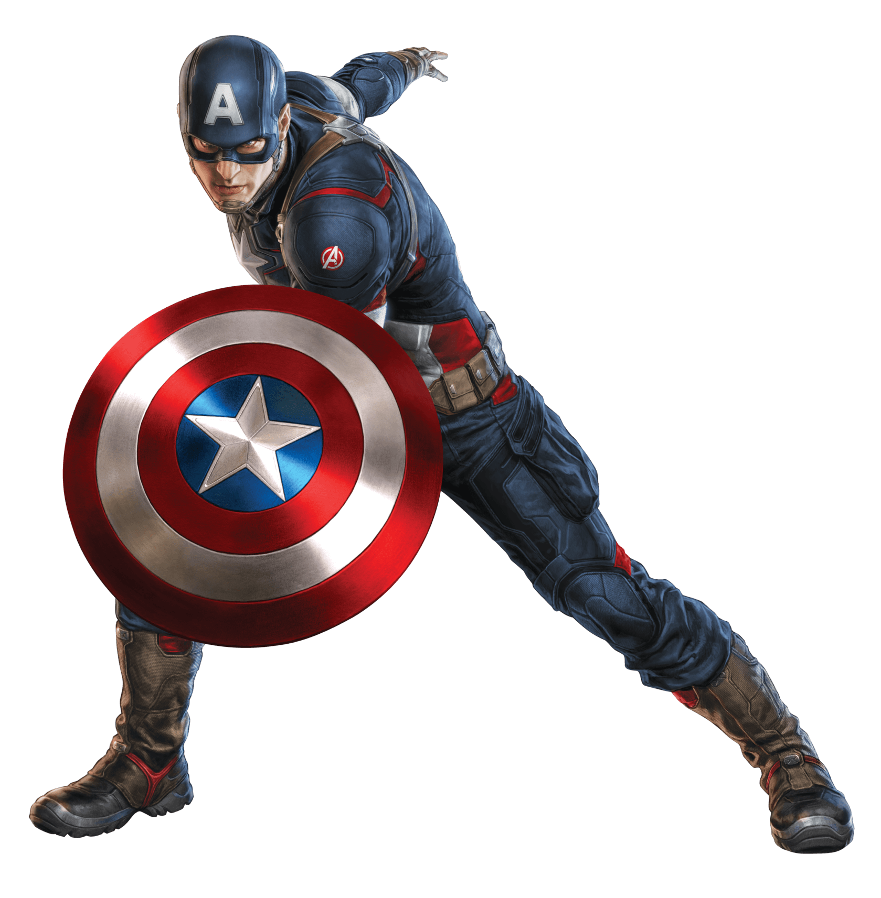
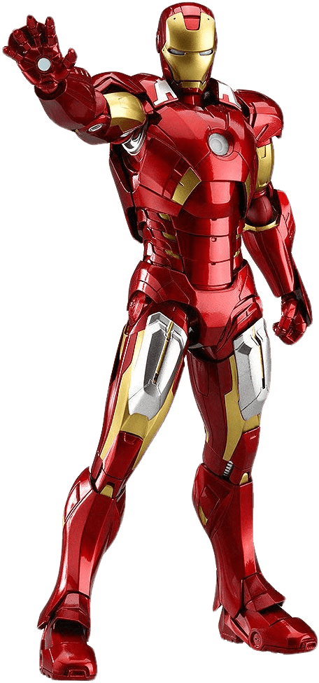

<!DOCTYPE html>
<html lang="en">

<head>
    <meta charset="UTF-8">
    <meta http-equiv="X-UA-Compatible" content="IE=edge">
    <meta name="viewport" content="width=device-width, initial-scale=1.0">
    <link rel="stylesheet" href="https://maxcdn.bootstrapcdn.com/bootstrap/4.0.0/css/bootstrap.min.css" integrity="sha384-Gn5384xqQ1aoWXA+058RXPxPg6fy4IWvTNh0E263XmFcJlSAwiGgFAW/dAiS6JXm" crossorigin="anonymous">
    <title>Avengers</title>
    
</head>

<body>
    

        

            

                <h2>Black Panthar</h2>
                
We miss you, You will be always in our heart. Dolor sit amet, Consec incididunt ut aliqua.

                <a href="#">Read more</a>
            

            
        

        

            

                <h2 style="color:#fff">Captain America</h2>
                
We miss you, You will be always in our heart. Dolor sit amet, Consec incididunt ut aliqua.

                <a style="background-color: #fff" href="#">Read more</a>
            

            
        

        

            

                <h2 style="color:#ffbb00">Iron man</h2>
                
We miss you, You will be always in our heart. Dolor sit amet, Consec incididunt ut aliqua.

                <a href="#">Read more</a>
            

            
        

    

    
    
    
</body>

</html>
